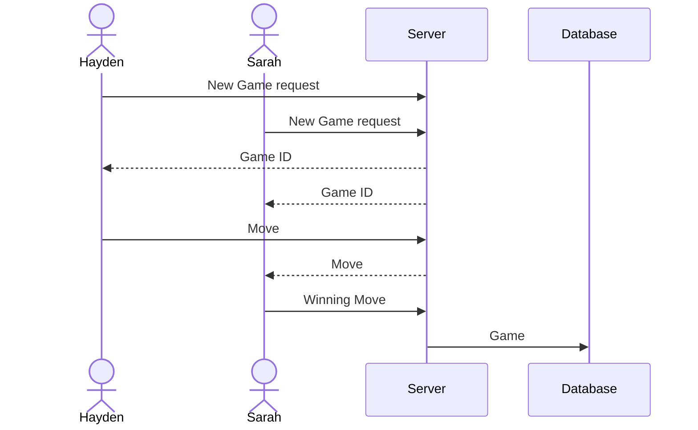

# CS240_CONNECT_FOUR

## Elevator Pitch

Connect Four is a classic two-player game of skill. Each player takes turns placing disks into columns. 
The first person to place four of their disks in a row, column, or diagonally wins. 
While the concept is simple, Connect Four requires calculations and skill in order to win. 
By creating a Connect Four website, people can play against a bot, or with a friend.

## Design

Here is a diagram showing how players would interact with the backend to play:

