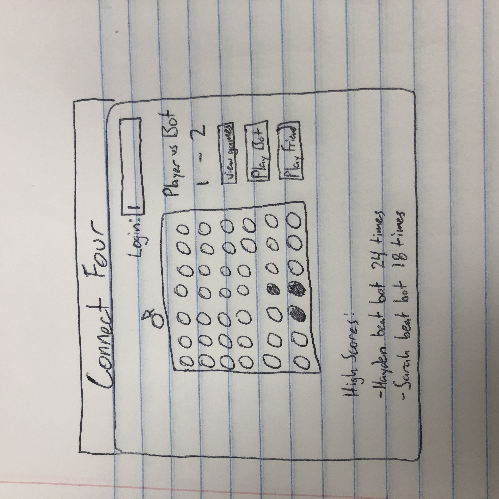
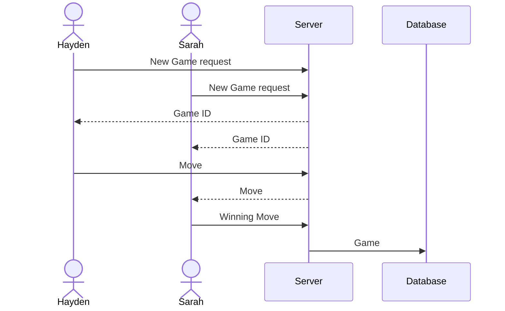

# CS240_CONNECT_FOUR

## Elevator Pitch

Connect Four is a classic two-player game of skill. Each player takes turns placing disks into columns. 
The first person to place four of their disks in a row, column, or diagonally wins. 
While the concept is simple, Connect Four requires calculations and skill in order to win. 
By creating a Connect Four website, people can play against a bot, or with a friend.

## Design

Here is a diagram showing how players would interact with the backend to play:

## Key Features

- Secure login with HTTPS
- Choose to play bot or player
- Display of game
- When player's turn, can select which row to drop into
- When game is done, it is stored in db
- Ability to explore database and see all recent games
- When playing against person or bot, a score will show

## Technologies

- **HTML** - Uses correct HTML structure for application. Two HTML pages. One for login and one for playing.
- **CSS** - Application styling for different screen sizes, uses good whitespace, color choice and contrast.
- **React** - Provides login, game display, score display and buttons, and use of React for routing and components.
- **Service** - Backend service with endpoints for:
  - login
  - creating games between players
  - making live moves & validating moves
  - retrieving games from db
- **DB/Login** - Store users and games in database. Register and login users. Credentials securely stored in database. Can't play unless authenticated.
- **WebSocket** - Connects two users to play against each other, and updates their moves

